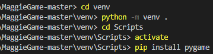

# MaggieGame

This is a re-make of the old SEGA game Columns, made using the third-party python library pygame.

# Pre-Requisites
Make sure python 3.8.2 or later is installed on your system.

# How to Install and Run

1. Download all the files as a zip folder.
2. Extract the MaggieColumns-Master folder.
3. Navigate into the MaggieColumns-Master folder, or open it in an IDE. (I used VS Code).
4. Create a new folder within the MaggieColumns-Master folder for the virtual environment. (I named it "venv".)

5. Create a virtual environment using "python -m venv ."
6. Navigate into the Scripts directory of the venv. (Should be venv/scripts). (Use "cd Scripts" command).
7. Activate by typing "activate".
8. Use "pip install pygame" command to install pygame.
9. Play the game by running the MaggieColumnsView.py module.
